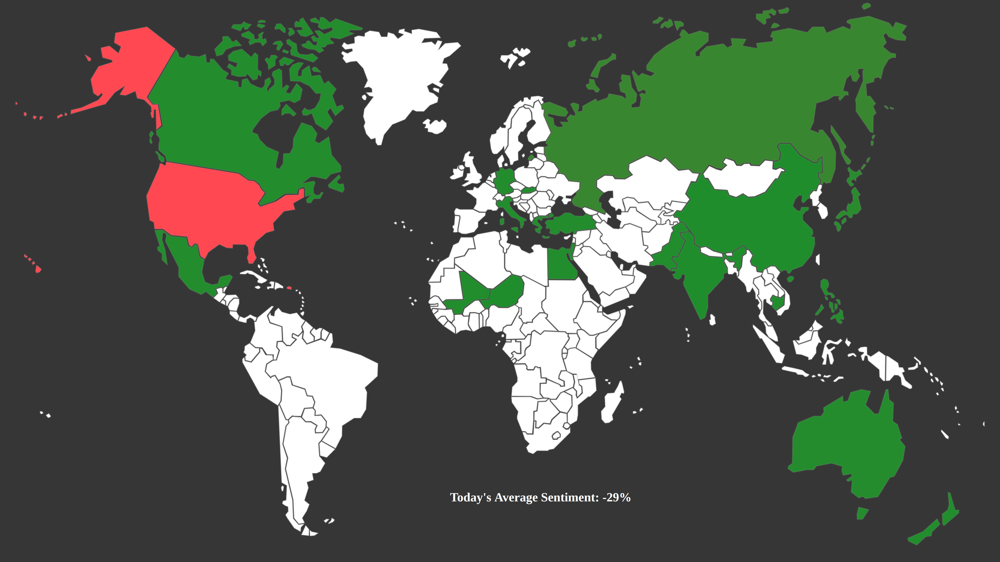

# World View
Analyzing world news for the codeday 24 hour hackathon. Received the "Best in Show" award (1st place).

Technologies
-----------------
- Python with IBM Watson for sentiment analysis of world news from reddit.com
- HTML, CSS, and Javascript

Contributors
------------------
Jess DeJong ([jessdejong](https://github.com/jessdejong)), Alex DeJong ([SinisterParadox](https://github.com/SinisterParadox)), Syed Pervaiz ([AliPervaiz](https://github.com/AliPervaiz)), Muhammad Khatri ([Darkness3840](https://github.com/Darkness3840)), and Siam Sarker
